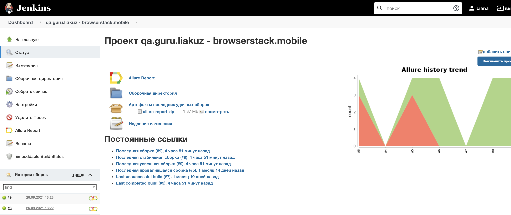
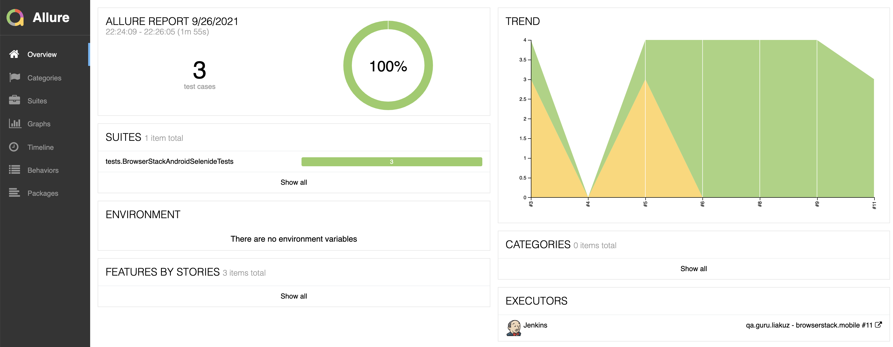
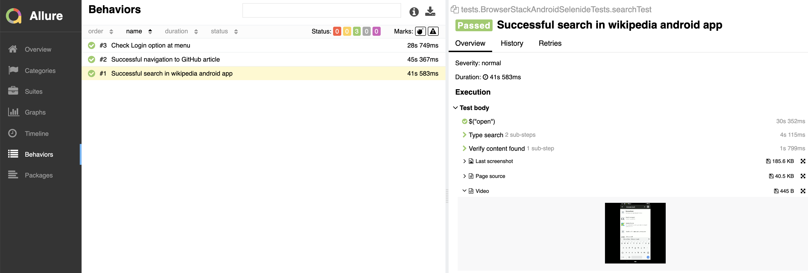
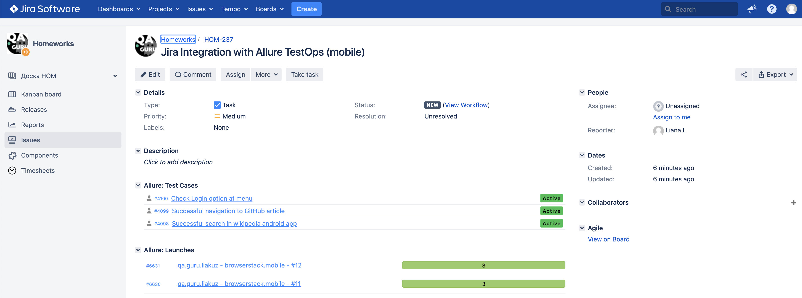

# Проект по автоматизации тестирования мобильного приложения Wikipedia (Android)

### Используемые технологии и инструменты:
<p align="left">


</p>

### Реализованы следующие тесты:
- [X] Поис в приложении Wikipedia
- [X] Переход к статье Wikipedia
- [X] Проверка наличия опции Login в меню

### Запуск тестов
#### Запуск тестов с использованием Jenkins:


#### Запуск тестов локально:
```bash
gradle clean test
```

### Allure отчет для отображения результатов тестирования </br>
#### Общая информация

#### Список тестов c описанием шагов и визуализацией результатов


### Пример запуска теста в BrowserStack


### Интеграция с Allure TestOps </br>


### Интеграция с Jira </br>




### Уведомления в telegram о результатах теста </br>


:heart: <a target="_blank" href="https://qa.guru">qa.guru</a><br/>
:blue_heart: <a target="_blank" href="https://t.me/qa_automation">t.me/qa_automation</a>
